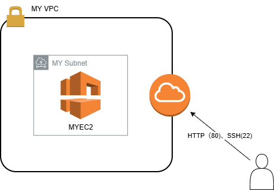
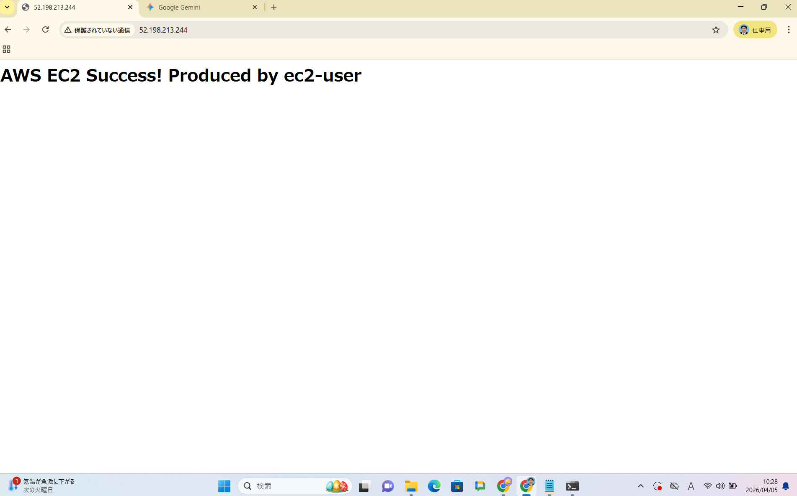

# 🚀 AWS EC2 構築プロジェクト (2026/04/05)

CloudFormation（IaC）を使用して、AWS上にVPC環境とWebサーバー（EC2）を自動構築しました。エラーの特定から解決、そして構成の図解までの記録です。

## 🏗️ システム構成図

---

## ❌ 発生したエラーと解決策

### 1. インスタンスタイプの制限 (Rollback発生)
- **現象**: `CREATE_FAILED` となり、ロールバックが発生。
- **原因**: エラーログに `not eligible for Free Tier`（無料枠の対象外）と表示。
- **対策**: インスタンスタイプを `t2.micro` から、最新世代で安定している **`t3.micro`** に変更。

### 2. ネットワーク疎通エラー (表示されない)
- **現象**: インスタンスは起動したが、ブラウザでIPアドレスを打っても応答なし。
- **原因**: ルートテーブルに **`0.0.0.0/0` (Internet Gateway行き)** の設定が漏れていた。
- **対策**: ルートテーブルに外の世界への出口を追加し、開通を確認。

---

## ✅ 動作確認
ブラウザにて Apache のテストページが表示されることを確認しました。

## 💡 学んだこと
- **ログの追い方**: CloudFormationの「イベント」タブで、赤くなっている根本原因を探す重要性。
- **インフラの可視化**: draw.io を使い、VPC/Subnet/IGW の位置関係を整理した。
- **コスト意識**: 動作確認後、即座にスタックを削除し、不要な課金を防止した。

---
*Produced by ec2-user*
