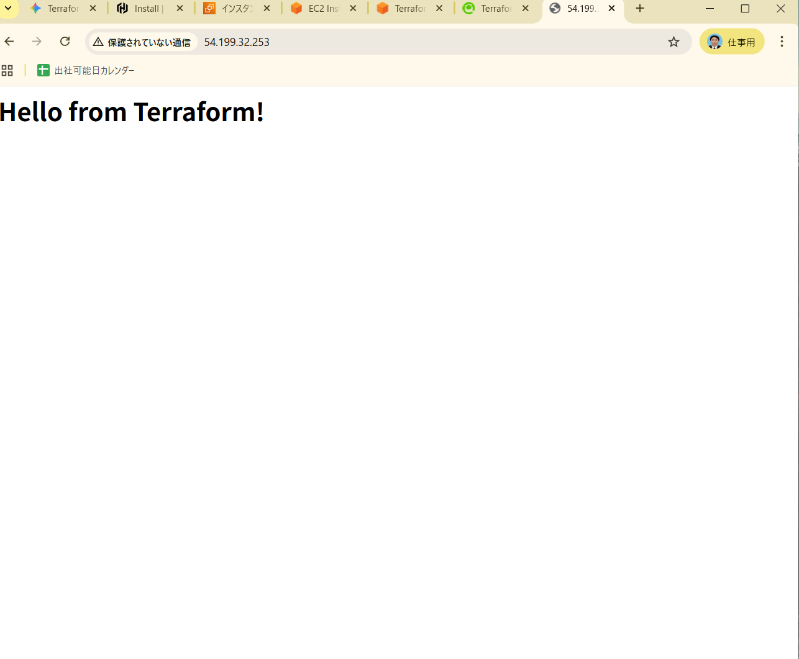

# 🚀AWS Web Server Deployment with Terraform

Terraformを使用して、AWS上にApache Webサーバーを自動構築するプロジェクトです。

## 構築内容
このコードを実行することで、以下のリソースが自動的に作成されます。
- **VPC / Subnet**: 隔離されたネットワーク環境
- **Internet Gateway**: 外部インターネットとの接続
- **Security Group**: HTTP(80番ポート)の許可設定
- **EC2 Instance**: Amazon Linux 2023 を使用したサーバー
- **User Data**: 起動時に自動でApacheをインストールし、Webページを表示

## 🏗️構成図 (イメージ)
[ここに構築した構成のイメージ図やスクショを貼る]

## 実行結果
ブラウザからパブリックIPにアクセスし、以下の画面が表示されることを確認済みです。

