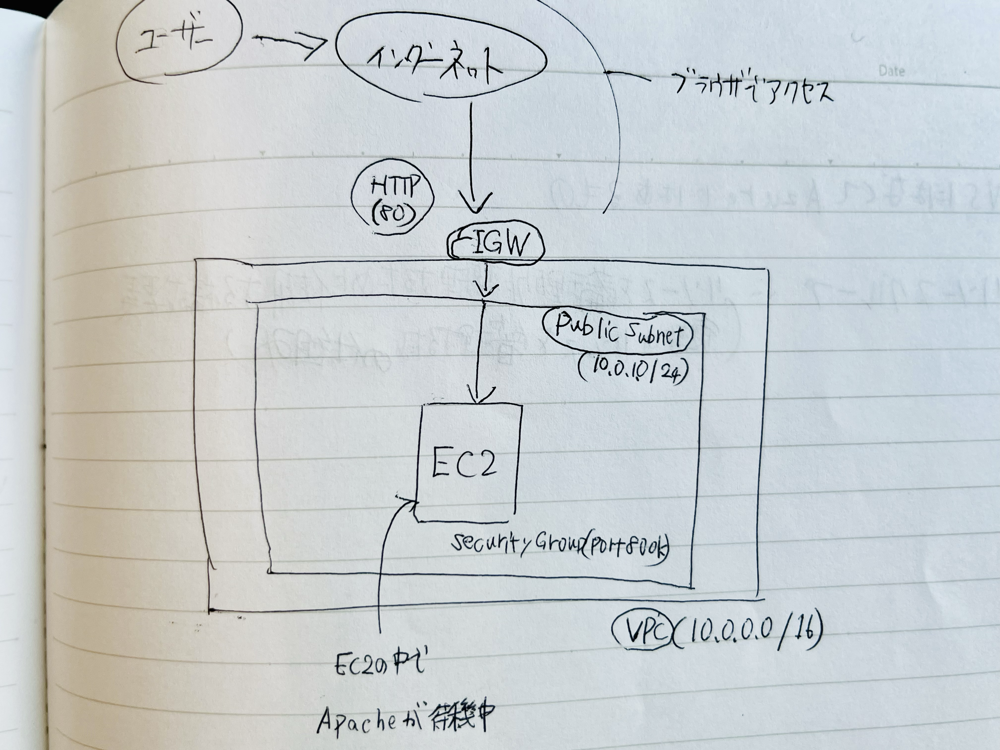

# 🚀 AWS Web Server Deployment via Terraform

Terraformを使用して、AWS上にWebサーバー環境をコードで自動構築するプロジェクトです。

---

## 📐 ネットワーク構成 (Network Architecture)
- **VPC**: 10.0.0.0/16
- **Public Subnet**: 10.0.1.0/24
- **Security**: インターネットからHTTP(80番ポート)のみを許可し、サーバーの安全性を確保しています。

## ⚙️ 自動化スクリプト (User Data)
EC2起動時に以下の処理を自動実行するように設定しています：
1. OSパッケージのアップデート
2. Apache (httpd) のインストール
3. Webサービスの起動・有効化
4. テスト用HTMLファイルの作成

## ✒️ ネットワーク構成図 (System Architecture)

自分で設計したネットワークの全体像です。
ユーザーからインターネットを経由して、どのようにEC2サーバーへ辿り着くかのフローを可視化しました。




### 図のポイント
- **Public Subnet**: インターネットから直接アクセス可能なエリアを定義。
- **Inbound Flow**: ユーザーからのHTTPリクエストがIGWを通ってEC2に到達する流れを矢印で記載。
- **Security Group**: サーバー直前で不要な通信をブロックしている様子を表現。


---

## 🏗 構築リソース一覧
コードを実行することで、以下のインフラ要素が自動生成されます。

### 🌐 Network
* **VPC**: 隔離された仮想ネットワーク環境の構築
* **Subnet**: パブリックサブネットの作成
* **Internet Gateway**: 外部通信用ゲートウェイの接続
* **Route Table**: インターネットへのルート配送設定

### 🛡️ Security
* **Security Group**: インバウンド(80/TCP)およびアウトバウンドの制御

### 💻 Compute
* **EC2 Instance**: Amazon Linux 2023 を使用した仮想サーバー
* **User Data**: シェルスクリプトによる Apache(httpd) の自動セットアップ

---

## ⚡ 実行環境
* **Terraform**: v1.14.9
* **Cloud Provider**: AWS (ap-northeast-1)
* **OS**: Amazon Linux 2023

---

## 📸 実行結果
構築後、ブラウザからパブリックIPにアクセスして以下の画面が表示されることを確認しました。


---

## 🗒️ 使い方

1. **初期化**
   ```bash
   terraform init

2. **リソースの確認と反映**
   ```bash
   terraform plan   # 作成されるリソースの確認
   terraform apply  # 実際の構築（"yes" と入力）

3. **リソースの削除**
   ```bash
   terraform destroy   # リソースを削除する

---

## 🛠 Troubleshooting

今回の構築・ドキュメント作成において発生した問題と解決策を記録します。

### 1. READMEで画像（ブラウザ画面・構成図）が表示されない
- **事象:** 画像パスを記述したが、GitHub上で画像が表示されない。
- **原因:** - ファイルパスの指定ミス（相対パスの階層間違い）。
  - 大文字・小文字の不一致（例：`image.PNG` と `image.png`）。
- **解決策:** - フォルダ構成を `./images/` に統一。
  - GitHubのブラウザ編集画面から直接画像をドラッグ＆ドロップしてパスを再生成した。

### 2. Terraform実行時のAWS認証エラー
- **事象:** `terraform apply` 実行時に認証エラーが発生。
- **原因:** AWS CLIの認証情報が有効期限切れ、または未設定。
- **解決策:** `aws configure` コマンドで Access Key と Secret Key を再設定し、正しいIAM権限を確認した。

### 3. ブラウザからEC2にアクセスできない
- **事象:** インスタンスは起動しているが、ブラウザでパブリックIPを叩いてもタイムアウトする。
- **原因:** セキュリティグループのインバウンドルールで HTTP (80番ポート) が許可されていなかった。
- **解決策:** セキュリティグループに `0.0.0.0/0` からの Port 80 許可ルールを追記して再適用。
